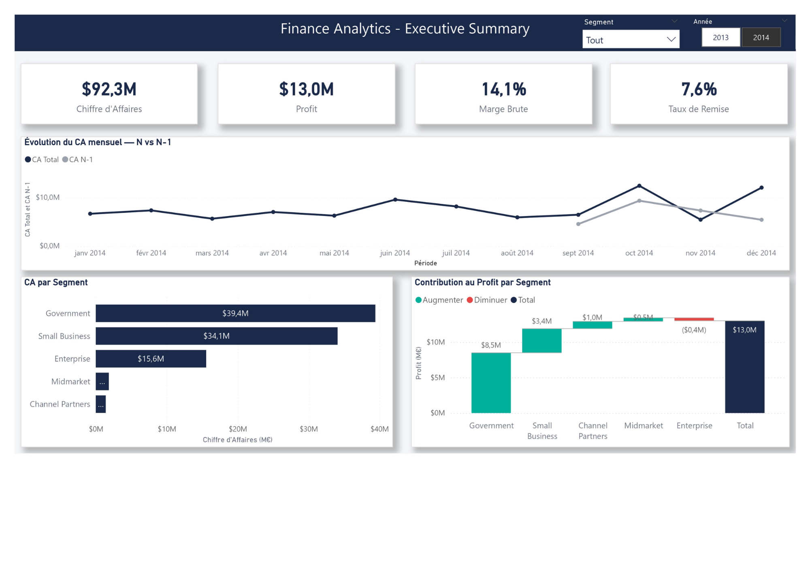

# 💰 Finance Analytics Dashboard — Power BI

## 📊 Aperçu

Dashboard de pilotage financier couvrant le P&L, l'analyse
YTD/YoY et le suivi Budget vs Réalisé pour une PME de distribution.

## 🎯 Contexte Business

Une PME de distribution souhaite piloter sa performance financière
mensuelle, comparer le réalisé au budget et anticiper les tensions
de rentabilité par segment et par produit.

## ❓ Questions Business Traitées

1. Quelle est notre performance financière vs N-1 et vs Budget ?
2. Sur quels segments et produits se concentre la profitabilité ?
3. Notre marge se dégrade-t-elle sur certains produits ?
4. Quels sont les signaux d'alerte financiers ce mois-ci ?

## 🛠️ Stack Technique

| Outil | Usage |
|-------|-------|
| Power BI Desktop | Modélisation & Dashboard |
| Power Query (M) | ETL & Nettoyage |
| DAX | Calculs & KPIs |

## 📐 Architecture Data

Modèle en constellation (star schema étendu) :

- 1 table de faits principale : fact_Finance (700 lignes)
- 1 table de faits secondaire : fact_Budget (700 lignes)
- 4 dimensions : dim_Produit, dim_Segment,
                 dim_Geographie, dim_Calendrier
- 1 table de mesures : _Mesures (30 mesures DAX)

## 📈 KPIs Principaux

| KPI | Description |
|-----|-------------|
| CA Total | Chiffre d'affaires total |
| CA YTD | CA cumulé année en cours |
| Croissance YoY CA | Variation CA vs année précédente |
| Marge Brute % | Profit / CA Total |
| Écart Budget % | Réalisé vs Budget |
| Atteinte Budget % | Taux d'atteinte des objectifs |

## 🗂️ Structure du Projet

    finance-analytics/
    ├── data/
    │   └── financial_sample.csv
    ├── powerbi/
    │   └── finance_dashboard.pbix
    ├── screenshots/
    │   ├── 01_Executive_Summary.png
    │   ├── 02_PL_Analysis.png
    │   ├── 03_Performance_Produits.png
    │   └── 04_Budget_vs_Actual.png
    └── README.md

## 🔍 Pages du Dashboard

| Page | Contenu |
|------|---------|
| Executive Summary | KPIs globaux, évolution CA, contribution Profit |
| P&L Analysis | Compte de résultat mensuel, Marge vs COGS |
| Performance Produits | Rentabilité produits, carte géo, Top 5 |
| Budget vs Actual | Suivi budgétaire, écarts par segment |

## ✅ Qualité des Données

- Source : Kaggle Financial Sample Dataset
- Nettoyage : format monétaire US, valeurs comptables négatives
- Doublons : vérification sur clé composite — 0 doublon pur détecté
- Granularité : 700 transactions uniques
- Budget : données synthétiques générées avec coefficients
  mensuels et par segment (±8-12% vs réalisé)

## 🔗 Sources

- [Dataset — Kaggle Financial Sample]
  (https://www.kaggle.com/datasets/atharvaarya25/financials)
- [Microsoft PL-300 Certification]
  (https://learn.microsoft.com/fr-fr/certifications/exams/pl-300)
