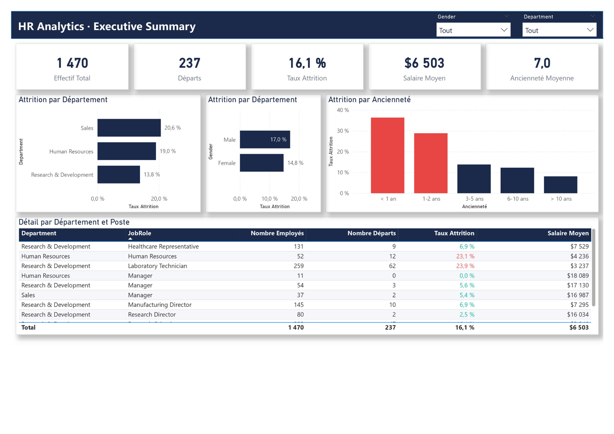

# 👥 HR Analytics Dashboard — Power BI

## 📊 Aperçu

Dashboard RH complet couvrant l'analyse d'attrition, l'équité
salariale et les scores de satisfaction pour une entreprise
de 1 470 employés.

## 🎯 Contexte Business

La Direction des Ressources Humaines souhaite réduire le taux
d'attrition, identifier les profils à risque de départ et
surveiller l'équité salariale entre hommes et femmes.

## ❓ Questions Business Traitées

1. Quel est notre taux d'attrition global et par département ?
2. Quels profils sont les plus à risque de départ ?
3. Y a-t-il des inégalités salariales par genre et département ?
4. La satisfaction au travail influence-t-elle les départs ?

## 🛠️ Stack Technique

| Outil | Usage |
|-------|-------|
| Power BI Desktop | Modélisation & Dashboard |
| Power Query (M) | ETL & Nettoyage |
| DAX | Calculs & KPIs |

## 📐 Architecture Data

Modèle en étoile (Star Schema) :

- 1 table de faits : fact_RH (1 470 lignes — 25 colonnes)
- 3 dimensions : dim_Employe, dim_Departement, dim_Calendrier
- 1 table de mesures : _Mesures (27 mesures DAX)

## 📈 KPIs Principaux

| KPI | Valeur |
|-----|--------|
| Effectif Total | 1 470 |
| Taux Attrition | 16,1% |
| Salaire Moyen | $6 503 |
| Écart Salarial H/F | -4,6% |
| Ancienneté Moyenne | 7,0 ans |
| Score Satisfaction | 2,7 / 4 |

## 🔍 Insights Clés

- Le département **Sales** présente le taux d'attrition
  le plus élevé
- Les employés avec **heures supplémentaires** ont un taux
  d'attrition significativement plus élevé
- Les **femmes gagnent en moyenne 4,6% de plus** que les
  hommes dans cette entreprise
- Les départs se concentrent sur les **< 2 ans d'ancienneté**
- La satisfaction au travail des employés partants est
  inférieure à la moyenne globale

## 🗂️ Structure du Projet

    hr-analytics/
    ├── data/
    │   └── hr_analytics.csv
    ├── powerbi/
    │   └── hr_dashboard.pbix
    ├── screenshots/
    │   ├── 01_Executive_Summary.png
    │   ├── 02_Analyse_Attrition.png
    │   ├── 03_Salaires_Equite.png
    │   └── 04_Satisfaction_Performance.png
    └── README.md

## 📄 Pages du Dashboard

| Page | Contenu |
|------|---------|
| Executive Summary | KPIs globaux, attrition par département et ancienneté |
| Analyse Attrition | Attrition par poste, âge, distance, heures sup |
| Salaires & Équité | Équité salariale H/F, distribution salaires |
| Satisfaction & Performance | Scores satisfaction, performance vs attrition |

## ✅ Qualité des Données

- Source : IBM HR Analytics Dataset — Kaggle
- 1 470 employés — 35 colonnes source
- 3 colonnes supprimées (constantes sans valeur analytique)
- 0 valeur manquante détectée
- Colonnes de satisfaction conservées dans fact_RH
  (bonnes pratiques modélisation dimensionnelle)

## 🔗 Sources

- [Dataset — IBM HR Analytics]
  (https://www.kaggle.com/datasets/pavansubhasht/ibm-hr-analytics-attrition-dataset)
- [Microsoft PL-300 Certification]
  (https://learn.microsoft.com/fr-fr/certifications/exams/pl-300)
