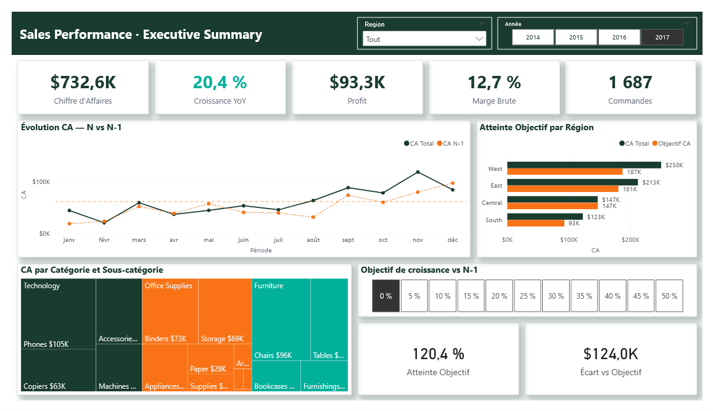

# 🛒 Sales Performance Dashboard — Power BI

## 📊 Aperçu

Dashboard commercial complet couvrant la performance des ventes,
l'analyse clients, les objectifs et les tendances pour une
entreprise de distribution multi-régions aux États-Unis.

## 🎯 Contexte Business

La direction commerciale souhaite piloter sa performance des
ventes par région et produit, suivre l'atteinte des objectifs
et identifier les opportunités de croissance et les risques
de dépendance clients.

## ❓ Questions Business Traitées

1. Quel est notre CA réalisé vs objectif par région ?
2. Quels produits et segments génèrent le plus de valeur ?
3. Quelle est la concentration de notre portefeuille clients ?
4. Comment évoluent nos tendances trimestrielles ?

## 🛠️ Stack Technique

| Outil | Usage |
|-------|-------|
| Power BI Desktop | Modélisation & Dashboard |
| Power Query (M) | ETL & Nettoyage |
| DAX | Calculs & KPIs |
| JSON | Thème personnalisé |

## 📐 Architecture Data

Modèle en étoile (Star Schema) :

- 1 table de faits : fact_Sales (9 986 lignes)
- 4 dimensions : dim_Produit, dim_Client,
                 dim_Geographie, dim_Calendrier
- 1 table de mesures : _Mesures (27 mesures DAX)
- 1 paramètre What-if : Taux Objectif

## 📈 KPIs Principaux

| KPI | Valeur |
|-----|--------|
| CA Total | $2,3M |
| Profit Total | $286K |
| Marge Brute | 12,5% |
| Nombre Commandes | 5 009 |
| Nombre Clients | 793 |
| Panier Moyen | $458 |

## 🔍 Insights Clés

- La région **West** génère le CA le plus élevé
- La catégorie **Technology** affiche la meilleure marge
- La **concentration Top 10 clients** mesure le risque de
  dépendance — les 10 meilleurs clients représentent ~20%
  du CA total, indiquant un portefeuille bien diversifié
- Les **Tables** et **Bookcases** affichent des marges
  négatives — axe d'optimisation prioritaire
- Le paramètre **What-if objectif** permet de simuler
  différents scénarios de croissance de 0% à 50%

## 🔍 Fonctionnalités Avancées Power BI

- **Thème JSON personnalisé** — palette vert foncé #1A3C2E
  et orange #F97316
- **Paramètre What-if** — simulation objectifs de croissance
- **Drill-through** — fiche détail par région avec bouton
  retour
- **Tooltip page** — info-bulle enrichie au survol des
  graphiques
- **Bookmarks + boutons** — navigation Vue CA / Vue Profit
  sur la Page 4
- **HASONEVALUE** — mesures Time Intelligence robustes
  sans contexte de filtre ambigu

## 🗂️ Structure du Projet

    sales-performance/
    ├── data/
    │   └── superstore.csv
    ├── powerbi/
    │   ├── sales_dashboard.pbix
    │   └── Sales_Theme.json
    ├── screenshots/
    │   ├── 01_Executive_Summary.png
    │   ├── 02_Regions_Produits.png
    │   ├── 03_Analyse_Clients.png
    │   └── 04_Objectifs_Tendances.png
    └── README.md

## 📄 Pages du Dashboard

| Page | Contenu |
|------|---------|
| Executive Summary | KPIs globaux, CA N vs N-1, Treemap, simulation What-if |
| Régions & Produits | Carte géo, Top 7 sous-catégories, Matrice, Drill-through |
| Analyse Clients | Segments, Top 6 clients, Évolution CA et clients |
| Objectifs & Tendances | CA vs Objectif, Bookmarks Vue CA/Profit, Tendances trimestrielles |

## ✅ Qualité des Données

- Source : Kaggle Superstore Dataset
- 9 994 lignes source — 8 doublons supprimés sur clé
  composite Order ID + Product ID
- Dataset final : 9 986 transactions uniques
- Colonnes numériques : conversion locale en-US
  (point comme séparateur décimal)
- Dates : conversion avec paramètres régionaux en-US
- dim_Produit : déduplication sur Product ID
  (1 862 produits uniques)

## 📌 Décisions UX

- Top N limité (Top 6 clients, Top 7 sous-catégories,
  Top 7 villes) pour garantir la lisibilité sans scroll
- Pages Drill-through et Tooltip masquées pour simplifier
  la navigation utilisateur
- Sélection 2017 par défaut via Bookmarks pour afficher
  les données les plus récentes à l'ouverture

## 🔗 Sources

- [Dataset — Kaggle Superstore]
  (https://www.kaggle.com/datasets/vivek468/superstore-dataset-final)
- [Microsoft PL-300 Certification]
  (https://learn.microsoft.com/fr-fr/certifications/exams/pl-300)
